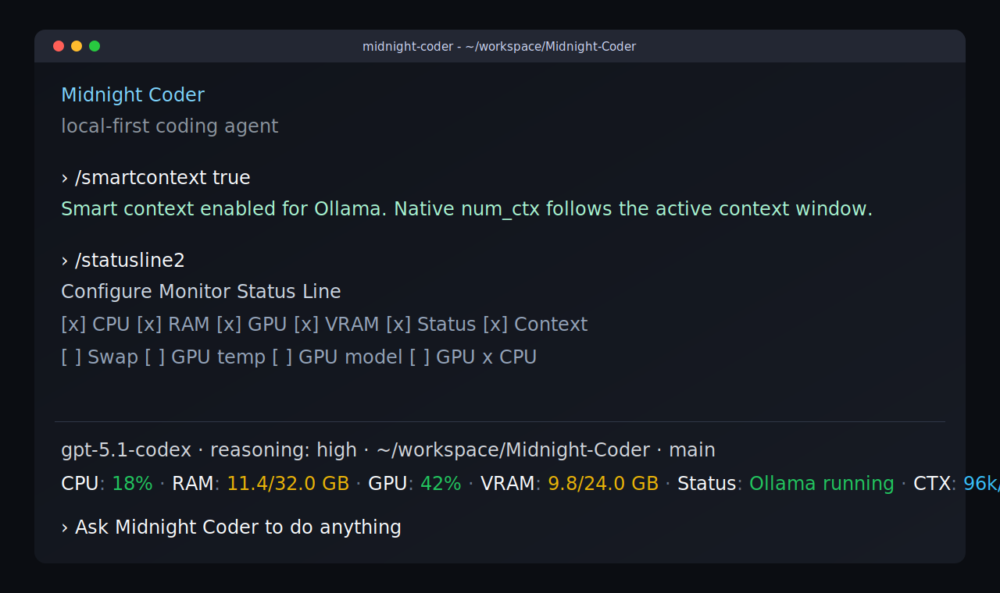

# Midnight Coder

Midnight Coder is a local-first coding agent built around the midnight-coder CLI and the Rust workspace in `codex-rs/`.

## Install

```bash
npm install -g midnight-coder
```

## Local model setup

Use the built-in provider flow to point Midnight Coder at a local model server.

1. Open `/provider_conf`
2. Enter an address such as `127.0.0.1:11434`
3. Midnight Coder probes the endpoint, checks `/api/tags` and `/v1/models`, and stores the detected provider and model
4. Use `/model` to pick the model exposed by the server and adjust the reasoning effort for the current run

Useful commands:

```text
/provider_conf
/model
/smartcontext true
```

For Ollama-backed models, `/smartcontext true` enables native smart context sizing. Midnight Coder
uses the active model context window to send the right `num_ctx` value to Ollama. Use
`/smartcontext false` to disable it again, or set it directly in `config.toml`:

```toml
ollama_smart_context = true
```

## Context control

Midnight Coder keeps session history explicit and bounded.

```text
/context
/smartcontext
/mini-model
/resume-type
/new
/clear
/compact
```

- `/context` sets the maximum context window before auto-compaction
- `/smartcontext` toggles Ollama native context sizing for local models
- `/mini-model` sets the model used for context compaction
- `/resume-type` sets the compaction strategy
- `/new` opens another chat during a conversation
- `/clear` starts a fresh chat
- `/compact` trims history when the conversation gets long

## Monitor status line

Use `/statusline2` to configure a second footer line with monitor data from the local model host.
It can show CPU, RAM, swap, GPU, GPU model, VRAM, GPU temperature, Ollama runtime status, context
usage, and GPU/CPU split.

```text
/statusline2
```

You can also configure it in `config.toml`:

```toml
[tui]
status_line_2 = ["cpu", "ram", "gpu", "vram", "status", "context"]
status_line_2_use_colors = true
```

When a local provider is configured, Midnight Coder reads monitor metrics from the provider host on
port `9898` at `/metrics`; the line stays hidden until metrics are available.



## What it includes

- Terminal workflow
- App server integration
- Python SDK
- TypeScript SDK
- Workspace-aware sandbox and approval rules

## Support

Your support helps keep Midnight Coder moving forward with new features, bug fixes, documentation, and infrastructure.

- Buy Me a Coffee: https://buymeacoffee.com/midnightcoder
- Pix: 38e0af8d-9f56-45cf-8bc8-688dbea4405a

## More

- [Repository](https://github.com/midnightcoderagent/Midnight-Coder)
- [Configuration guide](codex-rs/CONFIGURATION.md)
- [App server protocol](codex-rs/app-server/README.md)
- [Core crate notes](codex-rs/core/README.md)
